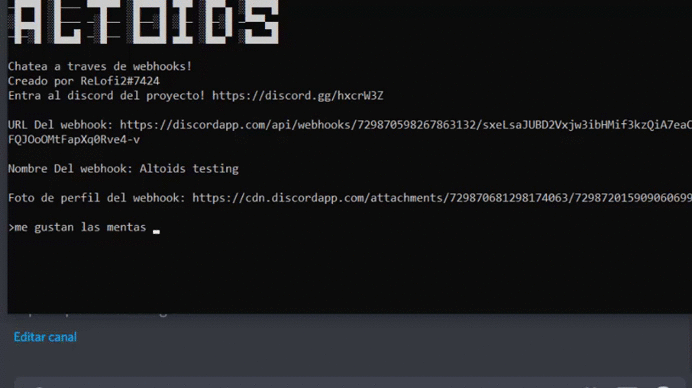

# Altoids
[]
[](https://forthebadge.com)
[](https://forthebadge.com)
[](https://forthebadge.com)<br/>
Altoids es un programa que te permite enviar mensajes a un webhook de discord como si estubieses chateando
## Instalacion
```bash
pip install requests
python altoids.py
```
## Contribuir
Si alguien le quiere añadir algo nuevo y cool , esta completamente bienvenido! 
## Servidor de discord
Aqui puedes ver el changelog y hacer preguntas sobre el programa uwu https://discord.gg/EZygMu8
